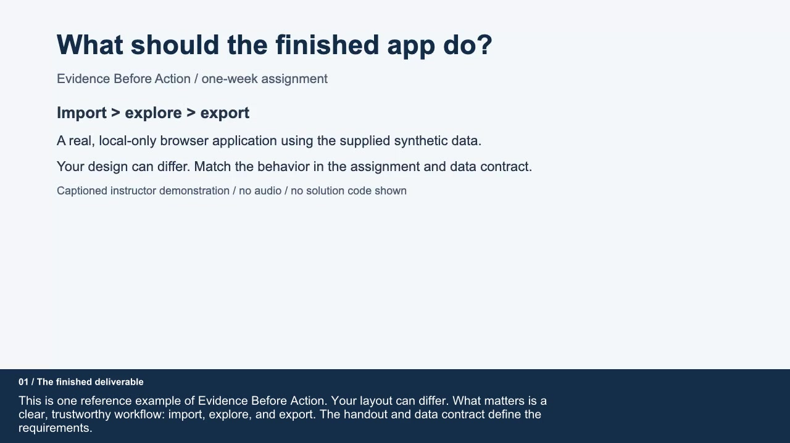

# Evidence Before Action
## A Copilot-assisted, local-first data workbench

**React + TypeScript homework | Individual | One-week submission window | 100 points**

## The problem

A fictional university's service team has exported its campus maintenance tickets. It can investigate **one campus zone** more closely next month. Which zone should it investigate, and how much confidence should it place in that recommendation?

Build a small browser application that lets an analyst **load a local CSV, inspect its quality, filter and summarize records, and download the evidence behind a recommendation**. A convincing interface that silently loses rows or misstates missing estimates is worse than a modest interface that tells the truth.

The supplied data is entirely synthetic. There is no single correct zone to recommend. There are correct and incorrect calculations, reproducible and irreproducible claims, and defensible and indefensible interpretations.

**You may use GitHub Copilot to generate all implementation code, tests, styling, and documentation.** You remain accountable for the behavior. Copilot cannot replace your actual peer observation or your individual explanation of an unseen example.

## Example final deliverable

**This video is only an example. Your final application does not need to look the same as the video.** You may use a different layout and visual style, but its functionality must remain consistent with this assignment and the [data and behavior contract](DATA-CONTRACT.md).

[**Watch or download the example video (MP4, 4:20)**](media/finished-deliverable.mp4) · [Read the transcript](media/transcript.txt) · [Download captions](media/captions.vtt)

The video is silent and includes on-screen captions.  The pacing on it is a little slow, feel free to watch it at 1.5x

## Start here

1. Read this brief and the normative [data and behavior contract](DATA-CONTRACT.md). Use the provided files in [data/](data/); no data acquisition is required.
2. Create a separate React + TypeScript + Vite project. Use Node.js 24, as recommended by the [classroom demo](../full-react-demo/README.md). Do not turn the ten-topic lecture demo into your submission.
3. Make the small independent prediction below, then build import -> explore -> export. Save one useful actual Copilot prompt/output excerpt.
4. Complete the acceptance checks and peer tryout, then submit through the designated course channel. No public deployment or separate early submission is required.

Use [verification.csv](data/verification.csv) for reasoning, [campus-tickets.csv](data/campus-tickets.csv) for the recommendation, and [edge-cases.csv](data/edge-cases.csv) for validation. The other three small files exercise failed/empty imports. **The 10,000-row stress file, generator, and performance benchmarking are not assigned.**

## Learning outcomes and lecture connections

You should be able to explain the path **event -> validated input -> state transition -> derived data -> rendered evidence**.

| Lecture material | Application responsibility |
| --- | --- |
| [Components and TSX](../full-react-demo/src/components/ComponentsDemo.tsx), [typed props](../full-react-demo/src/components/PropsDemo.tsx) | Compose focused import, filter, table, and summary interfaces; use stable ticket IDs. |
| [State](../full-react-demo/src/components/StateDemo.tsx) and [events](../full-react-demo/src/components/EventsDemo.tsx) | Keep imported facts separate from controlled filter inputs. |
| [Effects](../full-react-demo/src/components/EffectDemo.tsx) and [useFetch lifetime example](../full-react-demo/src/hooks/useFetch.ts) | Understand asynchronous completion and avoid obsolete updates; a local file needs no API. |
| [Filtering and memoization](../full-react-demo/src/components/UseMemoDemo.tsx) | Derive rows and summaries from common inputs; copy before sorting. |
| [Hardened comparisons](../slides/reference-examples.mjs) | Validate external values at runtime; TypeScript assertions do not decode data. |

CSV parsing, `File`/`Blob`, simple pagination, and a test runner are bounded extensions; Copilot and library documentation may help. **No required Context, custom-hook, `useReducer`, or memoization quota.** Use those tools only if they simplify this small app. Storage and advanced state-management demonstrations remain lecture material, not extra homework requirements.

## Required product

The contract supplies exact field rules, metrics, and the download shape. Do not add features beyond this scope.

### A. Import without losing trust

Read a user-selected local CSV with a labeled file picker and a locally installed parser such as [Papa Parse](https://www.papaparse.com/docs). Do not use `split(",")`. Show reading, loaded, empty, and error feedback.

Validate before replacing the active dataset. A nonfatal mixed file loads its valid subset and reports accepted/rejected **record** counts plus the record number, available ID, and reason for each rejection. A fatal error or zero accepted records preserves the previous analysis. There is **no required preview/confirmation stage**.

Disable the file picker while reading; allow selecting the same file again afterward. Keep the previous dataset visible until the new result is ready. Distinguish a failed attempt from the active file's import report.

### B. Explore one consistent set of records

Provide case-insensitive text search, **zone and status filters**, and the two specified sort orders. All filters combine. Use simple Previous/Next pagination with **50 records per page**; no page-size setting.

Show matching count, open count, overdue-open count, known open effort, and estimate coverage, overall and grouped by zone. A three-row summary table is sufficient; no chart is required.

The summaries and downloaded matching records must represent the **entire filtered set**, not just its current page. Unknown estimates are not zero estimates. Empty results need an explanation and a way to reset filters.

### C. Export the evidence

Download an **analysis JSON snapshot** containing current filters/sort, metrics, grouped summaries, and all matching normalized records. This is a local download, not an upload or a restorable backup. JSON re-import, annotations, record editing, exclusion controls, and undo are **not required**.

Use functional components, strict TypeScript, typed props/events, and appropriate state ownership. Derive rows/metrics rather than maintaining duplicate copies with effects. Keep everything in memory; **do not implement persistence**. Release download object URLs and avoid state updates after an import component unmounts.

### D. Make it pleasant with little CSS

**Recommended low-CSS path:** use [Pico CSS](https://picocss.com/docs) (or other framework) from the local npm package, semantic HTML, and a small layout stylesheet. An existing accessible React component library is an equally good choice. Bundle styles, icons, and fonts locally; do not rely on a runtime CDN.

Load framework CSS before your overrides and check the **computed** colors. A framework's default input borders may not meet the required 3:1 boundary contrast. For a fixed light Pico theme, `:root[data-theme="light"]` can override its theme variables without being defeated by a more specific framework selector.

Optional: use [Impeccable](https://github.com/pbakaus/impeccable), including its documented [Copilot-in-VS-Code extension](https://marketplace.visualstudio.com/items?itemName=renaissance-geek.impeccable), or follow [GitHub's skill guidance](https://docs.github.com/en/copilot/how-tos/copilot-on-github/customize-copilot/customize-cloud-agent/add-skills). Inspect compatibility, permissions, and bundled scripts; do not blanket-approve shell commands or hooks. A skill is not required and earns no points by itself.

Use assistance to improve hierarchy, spacing, labels, and feedback, not to add decorative complexity. This is an appropriate bounded prompt:

> Polish this small analyst workbench with the existing local styling library. Preserve its behavior and semantic HTML. Clarify import errors, filters, summaries, and download. Check labels, keyboard focus, contrast, and narrow-screen layout. Add no features, remote assets, or animations.

The required visual/accessibility baseline is:

- A clear page title, primary import action, readable typography, consistent spacing, and restrained colors. Convey status through text as well as color.
- Associated input labels, visible keyboard focus, semantic buttons and table headers, useful error/status announcements, and no keyboard trap. If you use dialogs, manage focus and return it to the trigger.
- Usability at **360px and 1280px viewport widths**, and at **200% browser zoom**. A labeled, keyboard-scrollable table region may scroll horizontally; the entire page should not require sideways scrolling to reach controls.
- Text contrast of at least **4.5:1** for normal text or **3:1** for large text, and **3:1** for essential control boundaries/focus indicators. Measure your chosen colors rather than assuming a generated theme passes.

If a styling library automatically follows the operating system's dark mode, either pin one theme or check every theme your app supports.

No chart, dashboard animation, dark mode, bespoke design system, or hand-written CSS quota is required.

## Client-only boundary and privacy

The app must have **no backend, database service, login, server function, external API, analytics, or runtime AI call**. Vite's development/preview server serves static assets; it is not an application backend.

After loading the production build's assets once, import/filter/export must work with the browser's network disabled. A fresh offline page load is **not** required; neither is a service worker. Do not lazy-load a required feature only after going offline.

Use the supplied synthetic data for development and observation. Files are read into memory and never transmitted by the app. Tell users that a reload/closed tab loses the working dataset. Export first to keep analysis evidence, but explain that a snapshot is **not a restorable session backup**. Local-only execution is not encryption, cross-tab isolation, or a blanket security guarantee.

Do not send participant identities, recordings, real service tickets, or other private information to Copilot. Copilot itself is a separate development service, not part of the application's privacy boundary. Render imported strings as text, never as HTML.

## Evidence you must produce

Use one `EVIDENCE.md`, **at most 800 words total**, including the recommendation and a short actual prompt excerpt; small numeric/check tables do not count. One screenshot is sufficient. Do not write a long report or submit a chat history.

### 1. Predict before delegating

Before the first implementation prompt, calculate all six metrics for `verification.csv`, first for all records and then for `zone=North, status=open`. Use paper, a calculator, or a spreadsheet, **not Copilot or your app**. Show IDs and arithmetic that distinguish blank estimates from zero.

Keep the original prediction and any explained correction in the final evidence file; **there is no separate checkpoint submission**. If you already used assistance, disclose it rather than backdating a claim; the live check can assess a fresh example.

### 2. Direct Copilot and audit its output

Briefly name the owners of imported rows, filters, and derived metrics. Document **one consequential Copilot decision** with a short real prompt/output excerpt, what you accepted or changed, a source/test location, and why the evidence supports it. A correctly accepted suggestion counts; no invented bug or forced rejection is needed.

### 3. Check three things automatically

Provide a local test command and **three named automated cases**:

1. `verification.csv`: normalized types and all-record metrics match independent calculations; blank and zero differ.
2. `edge-cases.csv`: counts, first-valid-duplicate handling, and quoted/newline text are correct.
3. Combined filters and sorting: expected matching IDs/metrics, unchanged source order, and matching export contents.

Use a suitable existing runner, such as Vitest or Node's test runner. Record a short pass/fail note for each acceptance row below. **No UI automation suite, original counterexample file, property-testing framework, profiler, benchmark, or performance report is required.**

## Acceptance matrix

Use the three automated cases above and short manual procedures for the remaining interactions. No extra test suite is implied.

| ID | Check | Observable result |
| --- | --- | --- |
| A1 | Import the eight-row fixture and compare the prediction. | Correct normalized types and metrics; zero is known, blank is unknown. |
| A2 | Import the edge-case fixture and inspect diagnostics. | Counts reconcile; duplicate/text rules hold; strings render literally. |
| A3 | With active data, try the three failed/empty fixtures and cancel the file chooser; then load a good file again. | Failed/canceled attempts preserve active data/filters/page; successful replacement resets controls; picker is disabled while reading and the same file can be selected again. |
| A4 | Combine filters, change sort/page, and select no matches. | Full-set summaries/export remain consistent; at most 50 main-table rows; clear empty state, no `NaN`/infinity. |
| A5 | Open the downloaded JSON and compare it with the current view. | Correct shape/types, filter metadata, grouped metrics, and all matching records, not one page. |
| A6 | Try keyboard, the stated widths/zoom, and network-off operation after initial load. | Readable, operable UI; local import/filter/export; no persistence or data transmission. |

## Submission and scoring

Submit source plus lockfile, a short README with setup/test/build instructions, the three tests **and their small CSV fixtures**, `EVIDENCE.md`, the recommendation's `analysis.json`, and one useful screenshot. Tests must not depend on files elsewhere on your machine. Exclude dependencies/build output, credentials, private participant data, and chat histories. List dependency/skill sources and disclose assistance. Confirm your documented commands work.

| Criterion | Points | Full-credit evidence |
| --- | ---: | --- |
| Trustworthy local import | 20 | Decoding/duplicates (10); reconciled diagnostics (6); safe replacement, limits, and read lifecycle (4). |
| Correct exploration and export | 15 | Filters/sort/page (5); overall/grouped metrics (6); faithful snapshot (4). |
| React and TypeScript implementation | 5 | Typed components and state ownership (3); immutable inputs and derived values (2). |
| Usability and client-only behavior | 10 | Keyboard/semantics (3); hierarchy, feedback, responsive/zoom/contrast checks (3); local/offline/privacy behavior (4). |
| Verification | 10 | Three meaningful automated cases (6); independent arithmetic (2); concise manual-check record (2). |
| Real observation and recommendation | 15 | Ethical, actual tryout evidence (5); justified revision or supported design choice (2); reproducible quantities/recommendation (4); uncertainty or alternative (4). |
| Five-minute individual check | 20 | Causal trace (10); predict, run, and reconcile an unseen variation (10). |
| Copilot engineering judgment | 5 | One actual, consequential decision supported by a source/test reference and evidence. |
| **Total** | **100** | **60 points for the engineered artifact/evidence; 40 for observation, defense, and accountable judgment.** |

Partial credit follows these subcriteria. Generated code is not penalized. An explained bug can earn reasoning credit even when it loses functionality points. The individual check uses the submitted version; no further feature work is expected after submission.

Reading a standalone LMS copy? The relative lecture links assume this folder remains under the lecture repository. The [pinned lecture source](https://github.com/bodonnell-DePaul/webapps_week03/tree/e5358d8e9055e7050709e283ce8f2a619dfc8a66) provides the same baseline online.
